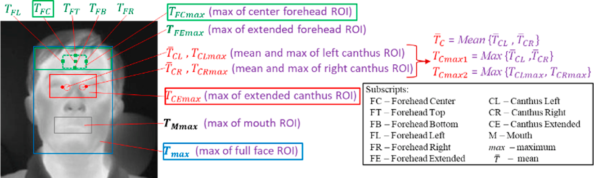
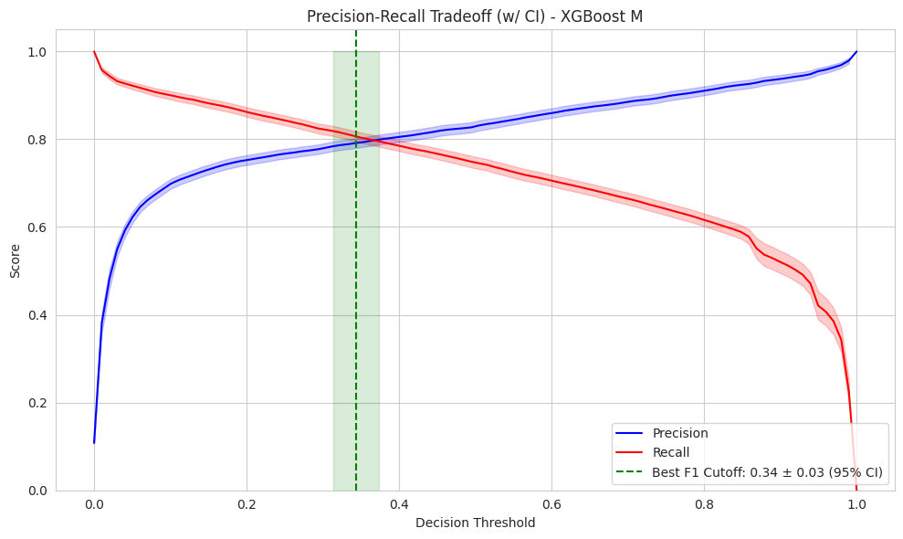
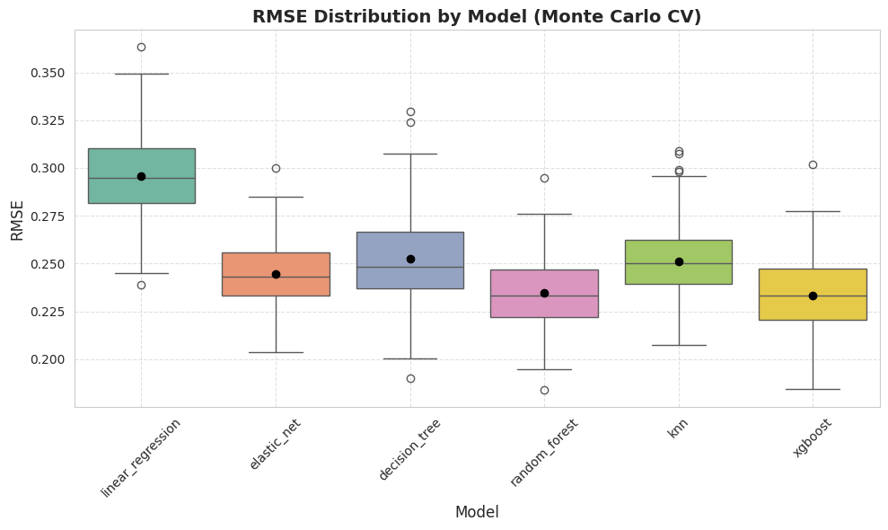
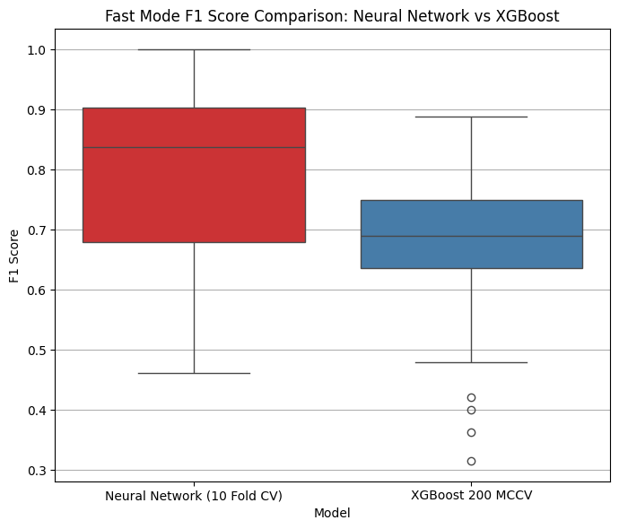
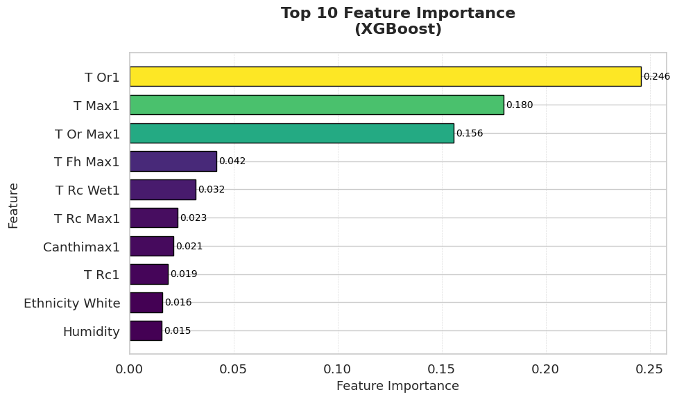

# Fever Prediction with Infrared Thermography

This project uses machine learning to predict oral temperature based on sensor data collected from infrared thermography. The aim is to explore whether non-invasive thermal data can be used to estimate fever status.

## Overview

- Regression + classification using Python & scikit-learn  
- Models: Linear Regression, XGBoost, MLP  
- Evaluation: RMSE, F1-score, SHAP for explainability  
- Nested Cross-Validation (200 iterations)

## Notebook

The full Colab notebook is available here:  
👉 [`Infrared_Thermography_Temperature.ipynb`](./Infrared_Thermography_Temperature.ipynb)

## Some Results

